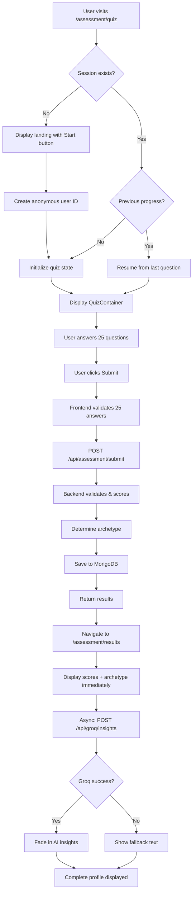

# Design Document: Assessment Module

## Overview

The Assessment Module is the core feature of FMindset, providing young founders (age 16-24) with a psychological self-assessment tool. The module implements a complete flow: anonymous authentication → 25-question quiz → scoring across 7 psychological dimensions → archetype classification → results visualization → AI-powered insights via Groq.

The architecture prioritizes:
- **Psychological safety**: Anonymous access, supportive messaging, no judgment
- **Performance**: < 2s page load, < 100ms quiz interactions, < 3s Groq calls
- **Reliability**: Deterministic scoring, graceful error handling, offline support
- **Mobile-first**: Responsive design for younger audience

## Architecture

### User Flow



### System Architecture

```mermaid
flowchart LR
    subgraph Frontend
        A[Quiz Page] --> B[QuizContainer]
        B --> C[QuizQuestion]
        D[Results Page] --> E[ResultsDisplay]
    end
    
    subgraph API Routes
        F[/api/assessment/submit]
        G[/api/groq/insights]
    end
    
    subgraph Services
        H[assessmentService]
        I[groqService]
    end
    
    subgraph External
        J[(MongoDB Atlas)]
        K[Groq API]
    end
    
    B -->|POST answers| F
    F --> H
    H --> J
    F -->|scores, archetype| E
    E -->|async| G
    G --> I
    I --> K
```

## Components and Interfaces

### QuizQuestion Component

**File**: `src/components/Assessment/QuizQuestion.tsx`
**Max Lines**: 150

```typescript
interface QuizQuestionProps {
  questionId: number;
  questionText: string;
  dimensionLabel: string;
  options: QuizOption[];
  selectedOption: string | null;
  onSelect: (questionId: number, answer: string) => void;
  progress: { current: number; total: number };
}

interface QuizOption {
  value: 'A' | 'B' | 'C' | 'D';
  label: string;
}
```

**Responsibilities**:
- Display dimension label, question text, 4 radio options
- Handle option selection with visual feedback
- Show progress indicator (e.g., "5/25")
- Mobile-responsive layout
- Hover effects on options

### QuizContainer Component

**File**: `src/components/Assessment/QuizContainer.tsx`
**Max Lines**: 250

```typescript
interface QuizContainerProps {
  onSubmit: (answers: string[]) => Promise<void>;
  initialAnswers?: string[];
  initialQuestionIndex?: number;
}

interface QuizContainerState {
  currentQuestionIndex: number;
  answers: (string | null)[];
  isSubmitting: boolean;
  error: string | null;
}
```

**Responsibilities**:
- Load and manage 25 questions
- Track current question index and all answers
- Navigate between questions (Previous/Next)
- Validate answer selection before advancing
- Disable Previous on Q1, show Submit on Q25
- Debounce rapid clicks
- Preserve state on navigation
- Handle submission flow

### ResultsDisplay Component

**File**: `src/components/Assessment/ResultsDisplay.tsx`
**Max Lines**: 250

```typescript
interface ResultsDisplayProps {
  scores: PsychologicalScores;
  archetype: ArchetypeResult;
  recommendations: string[];
  groqInsights: string | null;
  isLoadingInsights: boolean;
}
```

**Responsibilities**:
- Display archetype card (name, emoji, description)
- Render 7 score bars with color coding:
  - Green: 0-60
  - Yellow: 61-75 (caution zone tooltip)
  - Red: 76-100 (high risk tooltip)
- Show 2-3 recommendation cards (expandable)
- Display Groq insights with fade-in animation
- Show burnout alert if archetype is "Burning Out"
- Attribution text for AI insights

## Data Models

### TypeScript Interfaces

**File**: `src/types/assessment.ts`

```typescript
// Answer values
type AnswerValue = 'A' | 'B' | 'C' | 'D';

// Point mapping
const ANSWER_POINTS: Record<AnswerValue, number> = {
  A: 0,
  B: 33,
  C: 67,
  D: 100,
};

// Motivation types
type MotivationType = 'intrinsic' | 'extrinsic' | 'mixed';

// Psychological scores (7 dimensions)
interface PsychologicalScores {
  imposterSyndrome: number;    // Q1-5 average (0-100)
  founderDoubt: number;        // Q6-9 average (0-100)
  identityFusion: number;      // Q10-13 average (0-100)
  fearOfRejection: number;     // Q14-18 average (0-100)
  riskTolerance: number;       // Q19-21 average (0-100)
  motivationType: MotivationType; // Q22-24 comparison
  isolationLevel: number;      // Q25 (0-100)
}

// Archetype names (exact strings)
type ArchetypeName =
  | 'Perfectionist Builder'
  | 'Opportunistic Visionary'
  | 'Isolated Dreamer'
  | 'Burning Out'
  | 'Self-Assured Hustler'
  | 'Community-Driven'
  | 'Balanced Founder'
  | 'Growth Seeker';

// Archetype result
interface ArchetypeResult {
  name: ArchetypeName;
  description: string;
  traits: string[];
  strength: string;
  challenge: string;
  recommendation: string;
  isUrgent: boolean;        // true for Burning Out
  encouragement?: string;   // for Growth Seeker
}

// Quiz question structure
interface QuizQuestion {
  id: number;
  dimension: string;
  text: string;
  options: {
    A: string;
    B: string;
    C: string;
    D: string;
  };
}

// Assessment submission request
interface AssessmentSubmitRequest {
  answers: AnswerValue[];
}

// Assessment submission response
interface AssessmentSubmitResponse {
  scores: PsychologicalScores;
  archetype: ArchetypeResult;
  recommendations: string[];
}

// Groq insights request
interface GroqInsightsRequest {
  scores: PsychologicalScores;
  archetype: ArchetypeName;
}

// Groq insights response
interface GroqInsightsResponse {
  insights: string;
}
```

### MongoDB Schema

**File**: `src/services/mongooseModels.ts`

```typescript
// Assessment document schema
const AssessmentSchema = new Schema({
  userId: {
    type: String,
    required: true,
    index: true,
  },
  answers: {
    type: [String],
    required: true,
    validate: {
      validator: (arr: string[]) => arr.length === 25,
      message: 'Exactly 25 answers required',
    },
  },
  scores: {
    imposterSyndrome: { type: Number, required: true, min: 0, max: 100 },
    founderDoubt: { type: Number, required: true, min: 0, max: 100 },
    identityFusion: { type: Number, required: true, min: 0, max: 100 },
    fearOfRejection: { type: Number, required: true, min: 0, max: 100 },
    riskTolerance: { type: Number, required: true, min: 0, max: 100 },
    motivationType: { type: String, enum: ['intrinsic', 'extrinsic', 'mixed'], required: true },
    isolationLevel: { type: Number, required: true, min: 0, max: 100 },
  },
  archetype: {
    type: String,
    required: true,
    enum: [
      'Perfectionist Builder',
      'Opportunistic Visionary',
      'Isolated Dreamer',
      'Burning Out',
      'Self-Assured Hustler',
      'Community-Driven',
      'Balanced Founder',
      'Growth Seeker',
    ],
  },
  groqInsights: {
    type: String,
    default: null,
  },
  createdAt: {
    type: Date,
    default: Date.now,
  },
  updatedAt: {
    type: Date,
    default: Date.now,
  },
});

// UserProfile document schema
const UserProfileSchema = new Schema({
  odId: {
    type: String,
    required: true,
    unique: true,
    index: true,
  },
  isAnonymous: {
    type: Boolean,
    default: true,
  },
  pseudonym: {
    type: String,
    default: null,
  },
  passwordHash: {
    type: String,
    default: null,
  },
  assessmentIds: {
    type: [Schema.Types.ObjectId],
    ref: 'Assessment',
    default: [],
  },
  createdAt: {
    type: Date,
    default: Date.now,
  },
});
```

### The 25 Questions Data

```typescript
const QUIZ_QUESTIONS: QuizQuestion[] = [
  // Dimension 1: Imposter Syndrome (Q1-5)
  { id: 1, dimension: 'Imposter Syndrome', text: 'I feel like a fraud despite my achievements and abilities', options: { A: 'Strongly Disagree', B: 'Disagree', C: 'Agree', D: 'Strongly Agree' } },
  { id: 2, dimension: 'Imposter Syndrome', text: "I'm afraid people will discover I'm not as competent as they think", options: { A: 'Strongly Disagree', B: 'Disagree', C: 'Agree', D: 'Strongly Agree' } },
  { id: 3, dimension: 'Imposter Syndrome', text: 'When I succeed, it feels more like luck than my own doing', options: { A: 'Strongly Disagree', B: 'Disagree', C: 'Agree', D: 'Strongly Agree' } },
  { id: 4, dimension: 'Imposter Syndrome', text: "I often feel like I don't deserve my position as a founder", options: { A: 'Strongly Disagree', B: 'Disagree', C: 'Agree', D: 'Strongly Agree' } },
  { id: 5, dimension: 'Imposter Syndrome', text: "I'm afraid my startup idea isn't original or good enough", options: { A: 'Strongly Disagree', B: 'Disagree', C: 'Agree', D: 'Strongly Agree' } },
  
  // Dimension 2: Founder Doubt (Q6-9)
  { id: 6, dimension: 'Founder Doubt', text: 'I doubt whether my startup will actually succeed', options: { A: 'Strongly Disagree', B: 'Disagree', C: 'Agree', D: 'Strongly Agree' } },
  { id: 7, dimension: 'Founder Doubt', text: 'I question my ability to lead my company effectively', options: { A: 'Strongly Disagree', B: 'Disagree', C: 'Agree', D: 'Strongly Agree' } },
  { id: 8, dimension: 'Founder Doubt', text: "I worry that I don't have what it takes to be an entrepreneur", options: { A: 'Strongly Disagree', B: 'Disagree', C: 'Agree', D: 'Strongly Agree' } },
  { id: 9, dimension: 'Founder Doubt', text: "I'm unsure if I made the right decision to start this company", options: { A: 'Strongly Disagree', B: 'Disagree', C: 'Agree', D: 'Strongly Agree' } },
  
  // Dimension 3: Identity Fusion (Q10-13)
  { id: 10, dimension: 'Identity Fusion', text: "My self-worth is deeply tied to my startup's success", options: { A: 'Strongly Disagree', B: 'Disagree', C: 'Agree', D: 'Strongly Agree' } },
  { id: 11, dimension: 'Identity Fusion', text: 'I define myself primarily as a founder', options: { A: 'Strongly Disagree', B: 'Disagree', C: 'Agree', D: 'Strongly Agree' } },
  { id: 12, dimension: 'Identity Fusion', text: 'When my business struggles, it feels like a personal failure', options: { A: 'Strongly Disagree', B: 'Disagree', C: 'Agree', D: 'Strongly Agree' } },
  { id: 13, dimension: 'Identity Fusion', text: 'I struggle to separate my identity from my role as founder', options: { A: 'Strongly Disagree', B: 'Disagree', C: 'Agree', D: 'Strongly Agree' } },
  
  // Dimension 4: Fear of Rejection (Q14-18)
  { id: 14, dimension: 'Fear of Rejection', text: "I'm afraid the market will reject my product/service", options: { A: 'Strongly Disagree', B: 'Disagree', C: 'Agree', D: 'Strongly Agree' } },
  { id: 15, dimension: 'Fear of Rejection', text: 'I worry about what others think of my startup idea', options: { A: 'Strongly Disagree', B: 'Disagree', C: 'Agree', D: 'Strongly Agree' } },
  { id: 16, dimension: 'Fear of Rejection', text: 'I fear negative feedback on my business', options: { A: 'Strongly Disagree', B: 'Disagree', C: 'Agree', D: 'Strongly Agree' } },
  { id: 17, dimension: 'Fear of Rejection', text: "I'm concerned peers or competitors will judge my startup negatively", options: { A: 'Strongly Disagree', B: 'Disagree', C: 'Agree', D: 'Strongly Agree' } },
  { id: 18, dimension: 'Fear of Rejection', text: "I worry investors won't believe in my vision", options: { A: 'Strongly Disagree', B: 'Disagree', C: 'Agree', D: 'Strongly Agree' } },
  
  // Dimension 5: Risk Tolerance (Q19-21)
  { id: 19, dimension: 'Risk Tolerance', text: "I'm comfortable making bold decisions with uncertain outcomes", options: { A: 'Strongly Disagree', B: 'Disagree', C: 'Agree', D: 'Strongly Agree' } },
  { id: 20, dimension: 'Risk Tolerance', text: 'I embrace uncertainty as a necessary part of entrepreneurship', options: { A: 'Strongly Disagree', B: 'Disagree', C: 'Agree', D: 'Strongly Agree' } },
  { id: 21, dimension: 'Risk Tolerance', text: "I'm willing to take calculated risks for potentially big rewards", options: { A: 'Strongly Disagree', B: 'Disagree', C: 'Agree', D: 'Strongly Agree' } },
  
  // Dimension 6: Motivation Type (Q22-24)
  { id: 22, dimension: 'Motivation Type', text: "I'm driven primarily by my passion for solving this problem", options: { A: 'Strongly Disagree', B: 'Disagree', C: 'Agree', D: 'Strongly Agree' } },
  { id: 23, dimension: 'Motivation Type', text: "I'm motivated by the potential financial rewards", options: { A: 'Strongly Disagree', B: 'Disagree', C: 'Agree', D: 'Strongly Agree' } },
  { id: 24, dimension: 'Motivation Type', text: "I'm driven by external validation and recognition", options: { A: 'Strongly Disagree', B: 'Disagree', C: 'Agree', D: 'Strongly Agree' } },
  
  // Dimension 7: Isolation (Q25)
  { id: 25, dimension: 'Isolation', text: 'I feel isolated or lonely as a founder', options: { A: 'Strongly Disagree', B: 'Disagree', C: 'Agree', D: 'Strongly Agree' } },
];
```

### Services

#### assessmentService.ts

**File**: `src/services/assessmentService.ts`
**Max Lines**: 150

```typescript
// Point values for answers
const ANSWER_POINTS = { A: 0, B: 33, C: 67, D: 100 };

// Calculate average score for a range of questions
function calculateDimensionScore(answers: string[], startIndex: number, endIndex: number): number {
  const relevantAnswers = answers.slice(startIndex, endIndex + 1);
  const sum = relevantAnswers.reduce((acc, answer) => acc + ANSWER_POINTS[answer as keyof typeof ANSWER_POINTS], 0);
  return Math.round(sum / relevantAnswers.length);
}

// Determine motivation type from Q22-24
function determineMotivationType(answers: string[]): MotivationType {
  const passion = ANSWER_POINTS[answers[21] as keyof typeof ANSWER_POINTS];  // Q22
  const financial = ANSWER_POINTS[answers[22] as keyof typeof ANSWER_POINTS]; // Q23
  const recognition = ANSWER_POINTS[answers[23] as keyof typeof ANSWER_POINTS]; // Q24
  
  const extrinsicAvg = (financial + recognition) / 2;
  
  if (passion > extrinsicAvg) return 'intrinsic';
  if (extrinsicAvg > passion) return 'extrinsic';
  return 'mixed';
}

// Main scoring function
function calculateScores(answers: string[]): PsychologicalScores {
  // Validation
  if (answers.length !== 25) throw new Error('Exactly 25 answers required');
  if (!answers.every(a => ['A', 'B', 'C', 'D'].includes(a))) {
    throw new Error('All answers must be A, B, C, or D');
  }
  
  return {
    imposterSyndrome: calculateDimensionScore(answers, 0, 4),   // Q1-5
    founderDoubt: calculateDimensionScore(answers, 5, 8),       // Q6-9
    identityFusion: calculateDimensionScore(answers, 9, 12),    // Q10-13
    fearOfRejection: calculateDimensionScore(answers, 13, 17),  // Q14-18
    riskTolerance: calculateDimensionScore(answers, 18, 20),    // Q19-21
    motivationType: determineMotivationType(answers),
    isolationLevel: ANSWER_POINTS[answers[24] as keyof typeof ANSWER_POINTS], // Q25
  };
}

// Archetype determination
function determineArchetype(scores: PsychologicalScores): ArchetypeResult {
  // Count dimensions > 70 for burnout check
  const highDimensions = [
    scores.imposterSyndrome,
    scores.founderDoubt,
    scores.identityFusion,
    scores.fearOfRejection,
    scores.isolationLevel,
  ].filter(score => score > 70).length;
  
  // Check archetypes in priority order
  if (highDimensions >= 3) {
    return ARCHETYPES['Burning Out'];
  }
  if (scores.imposterSyndrome > 60 && scores.founderDoubt > 60 && scores.riskTolerance < 50) {
    return ARCHETYPES['Perfectionist Builder'];
  }
  if (scores.riskTolerance > 70 && scores.founderDoubt < 40 && scores.imposterSyndrome < 40) {
    return ARCHETYPES['Opportunistic Visionary'];
  }
  if (scores.isolationLevel > 70 && (scores.identityFusion > 50 || scores.founderDoubt > 50)) {
    return ARCHETYPES['Isolated Dreamer'];
  }
  if (scores.imposterSyndrome < 40 && scores.founderDoubt < 40 && scores.riskTolerance > 60) {
    return ARCHETYPES['Self-Assured Hustler'];
  }
  if (scores.isolationLevel < 40 && (scores.imposterSyndrome < 50 || scores.founderDoubt < 50)) {
    return ARCHETYPES['Community-Driven'];
  }
  // Check balanced (all 40-60)
  const numericScores = [
    scores.imposterSyndrome, scores.founderDoubt, scores.identityFusion,
    scores.fearOfRejection, scores.riskTolerance, scores.isolationLevel
  ];
  if (numericScores.every(s => s >= 40 && s <= 60)) {
    return ARCHETYPES['Balanced Founder'];
  }
  // Default to Growth Seeker
  return ARCHETYPES['Growth Seeker'];
}

// Get recommendations based on scores
function getRecommendations(scores: PsychologicalScores, archetype: ArchetypeName): string[] {
  const recommendations: string[] = [];
  
  if (scores.imposterSyndrome > 70) {
    recommendations.push('Document your wins daily - imposter syndrome fades when you see evidence of your competence.');
  }
  if (scores.founderDoubt > 70) {
    recommendations.push('Find a mentor who has been through the founder journey - their perspective will help ground your doubts.');
  }
  if (scores.isolationLevel > 70) {
    recommendations.push('Join a founder community this week - isolation amplifies every other challenge.');
  }
  if (scores.identityFusion > 70) {
    recommendations.push('Schedule non-startup activities weekly - your identity needs to be broader than your company.');
  }
  if (scores.fearOfRejection > 70) {
    recommendations.push('Reframe rejection as data - every "no" teaches you something about your market.');
  }
  
  // Add archetype-specific recommendation
  recommendations.push(ARCHETYPES[archetype].recommendation);
  
  return recommendations.slice(0, 3); // Max 3 recommendations
}
```

#### groqService.ts

**File**: `src/services/groqService.ts`
**Max Lines**: 80

```typescript
const GROQ_API_URL = 'https://api.groq.com/openai/v1/chat/completions';
const GROQ_MODEL = 'mixtral-8x7b-32768';
const GROQ_TIMEOUT = 3000;

function constructInsightPrompt(scores: PsychologicalScores, archetype: ArchetypeName): string {
  return `You are a supportive founder psychologist. A young founder (age 16-24) just completed a psychological assessment. Here are their scores (0-100, higher = more intense):

- Imposter Syndrome: ${scores.imposterSyndrome}
- Founder Doubt: ${scores.founderDoubt}
- Identity Fusion: ${scores.identityFusion}
- Fear of Rejection: ${scores.fearOfRejection}
- Risk Tolerance: ${scores.riskTolerance}
- Motivation Type: ${scores.motivationType}
- Isolation Level: ${scores.isolationLevel}

Their archetype is: ${archetype}

Provide:
1. A brief assessment of their psychological state (2-3 sentences)
2. 3 specific, actionable recommendations
3. 1 warning sign to watch for

Tone: Warm, supportive, non-clinical. Speak directly to the founder. Keep response under 300 words.`;
}

async function getInsights(scores: PsychologicalScores, archetype: ArchetypeName): Promise<string> {
  const controller = new AbortController();
  const timeoutId = setTimeout(() => controller.abort(), GROQ_TIMEOUT);
  
  try {
    const response = await fetch(GROQ_API_URL, {
      method: 'POST',
      headers: {
        'Authorization': `Bearer ${process.env.GROQ_API_KEY}`,
        'Content-Type': 'application/json',
      },
      body: JSON.stringify({
        model: GROQ_MODEL,
        messages: [{ role: 'user', content: constructInsightPrompt(scores, archetype) }],
        max_tokens: 500,
        temperature: 0.7,
      }),
      signal: controller.signal,
    });
    
    clearTimeout(timeoutId);
    
    if (!response.ok) {
      throw new Error(`Groq API error: ${response.status}`);
    }
    
    const data = await response.json();
    const insights = data.choices?.[0]?.message?.content || '';
    
    if (insights.length < 50) {
      throw new Error('Insights too short');
    }
    
    return insights;
  } catch (error) {
    clearTimeout(timeoutId);
    console.error('Groq API error:', error);
    return 'We\'re generating personalized insights for you. Check back in a moment.';
  }
}
```

### API Endpoints

#### POST /api/assessment/submit

**File**: `src/app/api/assessment/submit/route.ts`
**Max Lines**: 100

```typescript
export async function POST(request: Request) {
  try {
    const body = await request.json();
    const { answers } = body;
    
    // Validate answers
    if (!Array.isArray(answers) || answers.length !== 25) {
      return NextResponse.json({ error: 'Exactly 25 answers required' }, { status: 400 });
    }
    if (!answers.every(a => ['A', 'B', 'C', 'D'].includes(a))) {
      return NextResponse.json({ error: 'Invalid answer format' }, { status: 400 });
    }
    
    // Calculate scores and archetype
    const scores = calculateScores(answers);
    const archetype = determineArchetype(scores);
    const recommendations = getRecommendations(scores, archetype.name);
    
    // Get user ID from session (anonymous or authenticated)
    const session = await getServerSession(authOptions);
    const userId = session?.user?.id || 'anonymous-' + crypto.randomUUID();
    
    // Save to MongoDB
    await connectDB();
    const assessment = new Assessment({
      userId,
      answers,
      scores,
      archetype: archetype.name,
    });
    await assessment.save();
    
    return NextResponse.json({
      scores,
      archetype,
      recommendations,
      assessmentId: assessment._id,
    });
  } catch (error) {
    console.error('Assessment submission error:', error);
    return NextResponse.json({ error: 'Server error. Try again later.' }, { status: 500 });
  }
}
```

#### POST /api/groq/insights

**File**: `src/app/api/groq/insights/route.ts`
**Max Lines**: 60

```typescript
export async function POST(request: Request) {
  try {
    const body = await request.json();
    const { scores, archetype } = body;
    
    // Validate scores object
    const requiredFields = ['imposterSyndrome', 'founderDoubt', 'identityFusion', 
                           'fearOfRejection', 'riskTolerance', 'motivationType', 'isolationLevel'];
    if (!requiredFields.every(field => field in scores)) {
      return NextResponse.json({ error: 'Invalid scores object' }, { status: 400 });
    }
    
    // Get insights from Groq
    const insights = await getInsights(scores, archetype);
    
    return NextResponse.json({ insights });
  } catch (error) {
    console.error('Groq insights error:', error);
    // Return fallback instead of error
    return NextResponse.json({ 
      insights: 'We\'re generating personalized insights for you. Check back in a moment.' 
    });
  }
}
```


## Correctness Properties

*A property is a characteristic or behavior that should hold true across all valid executions of a system—essentially, a formal statement about what the system should do. Properties serve as the bridge between human-readable specifications and machine-verifiable correctness guarantees.*

### Property 1: Answer Validation Correctness

*For any* input array passed to calculateScores, the function SHALL accept arrays of exactly 25 elements where each element is 'A', 'B', 'C', or 'D', and SHALL reject all other inputs with a descriptive error.

**Validates: Requirements 3.2, 3.3**

### Property 2: Dimension Scoring Correctness

*For any* valid 25-answer array, calculateScores SHALL return scores where:
- imposterSyndrome equals the average of Q1-5 point values (A=0, B=33, C=67, D=100)
- founderDoubt equals the average of Q6-9 point values
- identityFusion equals the average of Q10-13 point values
- fearOfRejection equals the average of Q14-18 point values
- riskTolerance equals the average of Q19-21 point values
- motivationType equals 'intrinsic' if Q22 > avg(Q23,Q24), 'extrinsic' if avg(Q23,Q24) > Q22, else 'mixed'
- isolationLevel equals the Q25 point value

**Validates: Requirements 3.4, 3.5, 3.6, 3.7, 3.8, 3.9, 3.10**

### Property 3: Scoring Invariants

*For any* valid 25-answer array:
- All numeric scores SHALL be in range [0, 100] with no NaN or negative values
- Running calculateScores multiple times with identical input SHALL produce identical output (deterministic)
- The return value SHALL be a complete PsychologicalScores object with all 7 fields

**Validates: Requirements 3.11, 3.12, 3.14**

### Property 4: Archetype Classification Uniqueness

*For any* valid PsychologicalScores object, determineArchetype SHALL return exactly one archetype from the set: {'Perfectionist Builder', 'Opportunistic Visionary', 'Isolated Dreamer', 'Burning Out', 'Self-Assured Hustler', 'Community-Driven', 'Balanced Founder', 'Growth Seeker'}.

**Validates: Requirements 4.2, 4.3**

### Property 5: Archetype Result Completeness

*For any* archetype returned by determineArchetype, the result SHALL contain:
- name: non-empty string matching one of 8 archetypes
- description: non-empty string (1-2 sentences)
- traits: array of 2-3 non-empty strings
- strength: non-empty string
- challenge: non-empty string
- recommendation: non-empty string (1-2 sentences)

**Validates: Requirements 4.4, 4.5, 4.6, 4.7, 4.8**

### Property 6: Burning Out Detection

*For any* PsychologicalScores where 3 or more of {imposterSyndrome, founderDoubt, identityFusion, fearOfRejection, isolationLevel} exceed 70, determineArchetype SHALL return 'Burning Out' with isUrgent flag set to true.

**Validates: Requirements 4.9**

### Property 7: Growth Seeker Encouragement

*For any* PsychologicalScores that results in 'Growth Seeker' archetype, the result SHALL include a non-empty encouragement message.

**Validates: Requirements 4.10**

### Property 8: Score Color Coding

*For any* numeric score in the results display:
- Scores 0-60 SHALL be displayed with default (green) styling
- Scores 61-75 SHALL be displayed with yellow highlighting and "Caution zone" tooltip
- Scores 76-100 SHALL be displayed with red highlighting and "High risk" tooltip

**Validates: Requirements 5.4, 5.6, 5.7**

### Property 9: Quiz State Preservation

*For any* sequence of quiz interactions (selecting answers, navigating between questions):
- Selecting an option SHALL immediately update the stored answer for that question
- Changing an answer SHALL immediately replace the previous answer
- Navigating to any previously answered question SHALL display the saved answer as pre-selected
- All answers SHALL be preserved across navigation

**Validates: Requirements 2.3, 2.8, 2.9, 2.12**

### Property 10: Submission Debounce

*For any* rapid sequence of submit button clicks, the system SHALL process exactly one submission request.

**Validates: Requirements 7.4**

### Property 11: Error Logging Without Exposure

*For any* error that occurs in the system, the full error details SHALL be logged to console, and the user-facing message SHALL be a generic, non-technical message that does not expose system internals.

**Validates: Requirements 7.10**

### Property 12: Groq Request Validation

*For any* request to /api/groq/insights, the API SHALL validate that the scores object contains all 7 required fields (imposterSyndrome, founderDoubt, identityFusion, fearOfRejection, riskTolerance, motivationType, isolationLevel) and the constructed prompt SHALL include all dimension values and the archetype name.

**Validates: Requirements 6.2, 6.3**

### Property 13: Groq Error Resilience

*For any* Groq API error (timeout, network failure, invalid response), the system SHALL:
- Log the error to console
- Return fallback text to the frontend
- NOT throw an exception that would break the results display

**Validates: Requirements 6.9**

## Error Handling

### Frontend Error Handling

| Error Type | User Message | System Action |
|------------|--------------|---------------|
| Session expired | "Session expired. Your progress is saved." | Save to localStorage, show resume option |
| Validation error | "Please select an answer" / "All 25 questions required" | Highlight missing fields, preserve state |
| Network timeout | "Network timeout. Check connection." | Show retry button, preserve state |
| Offline | "You're offline. Progress saved locally." | Save to localStorage, sync when online |
| API 400 | "Invalid submission. Refresh." | Log error, preserve answers |
| API 500 | "Server error. Try again later." | Log error, show retry button |

### Backend Error Handling

| Error Type | HTTP Status | Response | Logging |
|------------|-------------|----------|---------|
| Invalid answers array | 400 | `{ error: "Exactly 25 answers required" }` | Warn level |
| Invalid answer format | 400 | `{ error: "Invalid answer format" }` | Warn level |
| MongoDB connection | 500 | `{ error: "Server error. Try again later." }` | Error level with stack |
| Groq timeout | 200 | `{ insights: "Generating insights..." }` | Warn level |
| Groq error | 200 | `{ insights: "Generating insights..." }` | Error level |
| Unknown error | 500 | `{ error: "Server error. Try again later." }` | Error level with stack |

### Graceful Degradation

1. **Groq API unavailable**: Results display immediately without insights; fallback text shown
2. **MongoDB unavailable**: Show error, allow retry, preserve client-side state
3. **Session expired**: Save to localStorage, allow anonymous resume
4. **Slow network**: Show loading states, don't block UI

## Testing Strategy

### Testing Framework

- **Unit Tests**: Jest with React Testing Library
- **Property-Based Tests**: fast-check library
- **Integration Tests**: Jest with supertest for API routes

### Unit Tests

Focus on specific examples and edge cases:

1. **Scoring Edge Cases**
   - All A answers (minimum scores)
   - All D answers (maximum scores)
   - Mixed patterns for each dimension

2. **Archetype Boundary Conditions**
   - Scores exactly at threshold values (e.g., 70, 60, 40)
   - Scores that could match multiple archetypes (priority order)

3. **Validation Errors**
   - Empty array
   - 24 answers
   - 26 answers
   - Invalid characters ('E', '1', null)

4. **Component Rendering**
   - QuizQuestion displays all elements
   - ResultsDisplay shows correct colors
   - Burnout alert appears when needed

### Property-Based Tests

Each property test runs minimum 100 iterations with randomly generated inputs.

**Test Configuration**:
```typescript
// fast-check configuration
fc.configureGlobal({ numRuns: 100 });
```

**Property Test Annotations**:
Each test must include a comment referencing the design property:
```typescript
// Feature: assessment-module, Property 2: Dimension Scoring Correctness
// Validates: Requirements 3.4, 3.5, 3.6, 3.7, 3.8, 3.9, 3.10
```

**Generator Strategy**:
```typescript
// Valid answer generator
const validAnswer = fc.constantFrom('A', 'B', 'C', 'D');
const validAnswerArray = fc.array(validAnswer, { minLength: 25, maxLength: 25 });

// Invalid answer generators for error testing
const invalidLength = fc.array(validAnswer, { minLength: 0, maxLength: 24 });
const invalidCharacter = fc.constantFrom('E', 'F', '1', '2', '', null);
```

### Integration Tests

1. **POST /api/assessment/submit**
   - Valid submission returns scores + archetype
   - Invalid answers return 400
   - Database persistence verified

2. **POST /api/groq/insights**
   - Valid request returns insights
   - Invalid scores return 400
   - Timeout returns fallback

3. **Full Flow**
   - Quiz completion → submission → results display
   - Anonymous user creation → quiz → results

### Manual QA Checklist

- [ ] Anonymous signup flow works
- [ ] All 25 questions display correctly
- [ ] Navigation (Previous/Next) preserves answers
- [ ] Submit validates all answers present
- [ ] Results display immediately
- [ ] Groq insights fade in
- [ ] Burnout alert shows for high-risk users
- [ ] Mobile responsive on iPhone/Android
- [ ] Offline mode saves progress
- [ ] Error messages are user-friendly
